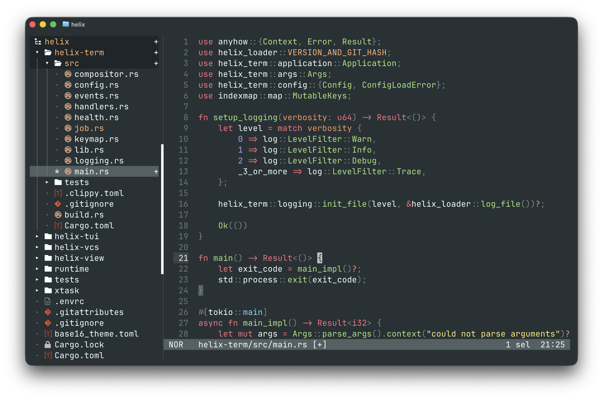

# Grove

Grove is a docked file tree for Helix, with Zed's project panel as its north
star.



<p align="center">
  <a href="#features">Features</a> ·
  <a href="#install">Install</a> ·
  <a href="#configuration">Configuration</a> ·
  <a href="#controls">Controls</a>
</p>

## Features

- Use Grove comfortably from the keyboard or mouse without giving up Helix's
  editor layout.
- Keep Git changes and unsaved work visible beside the code, even through
  collapsed directories.
- Stay oriented in deep workspaces as ancestor directories remain visible
  while you scroll.

## Install

Grove requires the Steel-enabled
[`hx-steel`](https://github.com/mattwparas/helix/blob/steel-event-system/STEEL.md)
build and does not work with stock Helix. On macOS, install the current build
through Homebrew:

```sh
brew install --HEAD ivoronin/ivoronin/hx-steel
```

To build the Steel fork manually instead, follow
[Up and running with Helix and Steel Scheme](https://www.tomwaddington.dev/steel-helix-first-steps.html).
The guide covers the source build, `PATH` setup, and initial Helix Scheme
configuration.

The formula lives in a personal tap but installs `hx`, Steel, and `forge`
directly from the upstream repository. Use Forge to install Grove and its
Scheme dependencies:

```sh
forge pkg install --git https://github.com/ivoronin/grove.hx.git
```

Add Grove to `~/.config/helix/init.scm`:

```scheme
(require "grove/grove.scm")
(require "helix/keymaps.scm")
```

Choose when Grove should start.

### Workspace-only

Start Grove only when Helix receives `-w` or `--working-dir`. Ordinary
file-editing sessions remain unchanged.

```scheme
(define (grove-workspace-launch?)
  (let loop ([args (cdr (command-line))])
    (cond
      [(null? args) #f]
      [(equal? (car args) "--") #f]
      [(or (equal? (car args) "-w")
           (equal? (car args) "--working-dir"))
       #t]
      [else (loop (cdr args))])))

(when (grove-workspace-launch?)
  (grove-start!))
```

Launch Helix with a Workspace explicitly:

```sh
hx -w .
```

`hx --working-dir .` is equivalent.

### Unconditional

Start Grove in every Helix session, using Helix's working directory as the
Workspace:

```scheme
(grove-start!)
```

With either mode, add a binding for keyboard navigation:

```scheme
(keymap (global)
  (normal
    (space
      (e ":grove-focus!"))))
```

This binds `Space e` to Grove. Merge the binding into your existing keymap or
choose another chord if `Space e` is already taken.

Do not use `hx .` with either mode. Helix treats a positional directory as a
request to open its native file picker before Steel components mount.

## Configuration

`grove-start!` accepts three optional settings:

| Setting | Default | Values |
| --- | --- | --- |
| `#:icons` | `#t` | `#t` or `#f` |
| `#:side` | `'left` | `'left` or `'right` |
| `#:width` | `32` | `16` through `64` |

For example:

```scheme
(grove-start!
  #:icons #f
  #:side 'right
  #:width 40)
```

Use this call directly for unconditional startup, or inside the
`grove-workspace-launch?` guard for workspace-only startup.

The width includes the Rail, which separates Grove from the editor and acts as
its scrollbar. Icons require a terminal font with Nerd Fonts 3.3 glyphs. Set
`#:icons` to `#f` if you do not use one.

## Controls

Keyboard commands apply after Grove receives focus through your configured
binding. Mouse input works without focusing Grove.

| Input | Action |
| --- | --- |
| `j` / `k`, `Up` / `Down` | Move through the tree |
| `h` / `l`, `Left` / `Right` | Collapse or expand a directory |
| `PageUp` / `PageDown` | Move by one visible page |
| `Enter` | Toggle a directory or open a file |
| `Ctrl-s` | Open a file in a horizontal split |
| `Ctrl-v` | Open a file in a vertical split |
| `+` / `-` | Resize Grove |
| `Escape` | Return focus to the editor |
| Click a file or directory | Open the file or toggle the directory |
| Mouse wheel | Scroll the tree |
| Click or drag the Rail | Page, scroll, or resize Grove |

The first key Grove does not bind returns focus to Helix and continues there,
so existing Helix mappings remain available.
